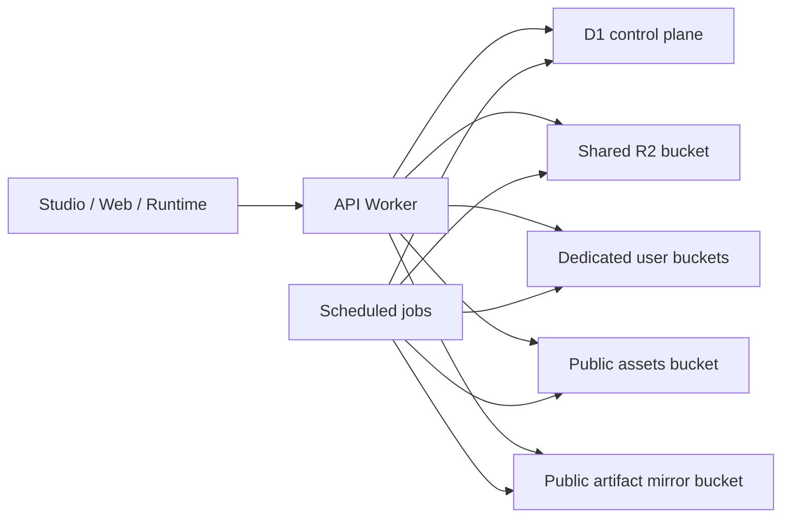

# Architecture

This is the high-level shape of the production storage subsystem behind Vibecodr.

For concrete source-backed examples, cross-check this document with the files under [../excerpts](../excerpts/README.md).

## The Core Claim

Vibecodr does not treat storage as "an R2 bucket with some uploads."

The storage system is a platform subsystem with at least six coupled concerns:

- byte storage in R2
- ownership and lookup state in D1
- plan-aware bucket selection
- secure file serving
- public artifact mirroring
- cleanup and reconciliation

That is why the private source modules are large. The complexity is structural, not decorative.

## The Shape

## The Buckets Are Not The Whole Story

The important system boundary is the Worker plus the D1 control plane.

Why:

- private reads need auth and origin checks
- response headers matter for dangerous file types
- public eligibility can change after an artifact was once public
- free-to-paid migrations can leave data in multiple bucket lanes
- quota and ownership cannot be derived from bucket listing alone

Relevant evidence:

- [../excerpts/02-r2-buckets-fallback.ts](../excerpts/02-r2-buckets-fallback.ts)
- [../excerpts/04-r2-object-index.ts](../excerpts/04-r2-object-index.ts)
- [../excerpts/06-file-serving-security.ts](../excerpts/06-file-serving-security.ts)

## Shared Bucket, Dedicated Bucket, Public Lanes

The system intentionally uses multiple storage lanes:

- a shared private bucket
- dedicated per-user private buckets for paid storage
- a public assets bucket
- a separate public artifact mirror bucket

It exists because different object classes need different delivery and lifecycle behavior:

- user-visible media is not the same as runtime artifacts
- publicly cacheable runtime bundles are not the same as canonical private artifact storage
- deduplicated blobs need a shared physical home to work well across users and remixes

Relevant evidence:

- [../excerpts/03-blob-store.ts](../excerpts/03-blob-store.ts)
- [../excerpts/05-public-artifact-mirror.ts](../excerpts/05-public-artifact-mirror.ts)

## D1 Is The Storage Control Plane

The `r2_objects` table is not a side table. It is the thing that lets the platform answer product questions:

- who owns this object
- what category is it
- does it count toward quota
- how should it be served
- can it be downloaded by object id or share token
- what cleanup should happen if the backing bytes disappear

The same applies to:

- `blobs`
- `capsule_blobs`
- `dependency_objects`
- `dependency_object_aliases`
- `artifact_dependency_refs`
- `public_artifact_mirror_leases`

Relevant evidence:

- [../excerpts/08-storage-schema.ts](../excerpts/08-storage-schema.ts)
- [../reference/schema.sql](../reference/schema.sql)

## The System Carries Migration History

The current architecture grew out of real problems:

- content-addressed capsule keys were too broad
- free-to-paid storage transitions created cross-bucket reality
- public runtime delivery could not safely share the canonical artifact lane
- canonical blob storage had to be introduced without breaking old reads

That is why there are compatibility and fallback paths in the source.

Relevant evidence:

- [../excerpts/01-r2-storage-structure.ts](../excerpts/01-r2-storage-structure.ts)
- [../excerpts/02-r2-buckets-fallback.ts](../excerpts/02-r2-buckets-fallback.ts)
- [../excerpts/07-capsule-gateway-canonicalization.ts](../excerpts/07-capsule-gateway-canonicalization.ts)

## Security Is Part Of Storage

The code does not assume "if a file exists, just return it."

Instead it centralizes:

- CSP for scriptable file types
- `nosniff`
- resource policy headers
- controlled serving paths for dangerous user-controlled content

Relevant evidence:

- [../excerpts/06-file-serving-security.ts](../excerpts/06-file-serving-security.ts)

## Tests Matter Here

The uncomfortable parts of the design are tested:

- cross-bucket fallback listing
- primary/fallback failure behavior
- public mirror access re-checks and in-memory bucket behavior

Relevant evidence:

- [../excerpts/09-r2-buckets.test.ts](../excerpts/09-r2-buckets.test.ts)
- [../excerpts/10-public-artifact-mirror.test.ts](../excerpts/10-public-artifact-mirror.test.ts)
