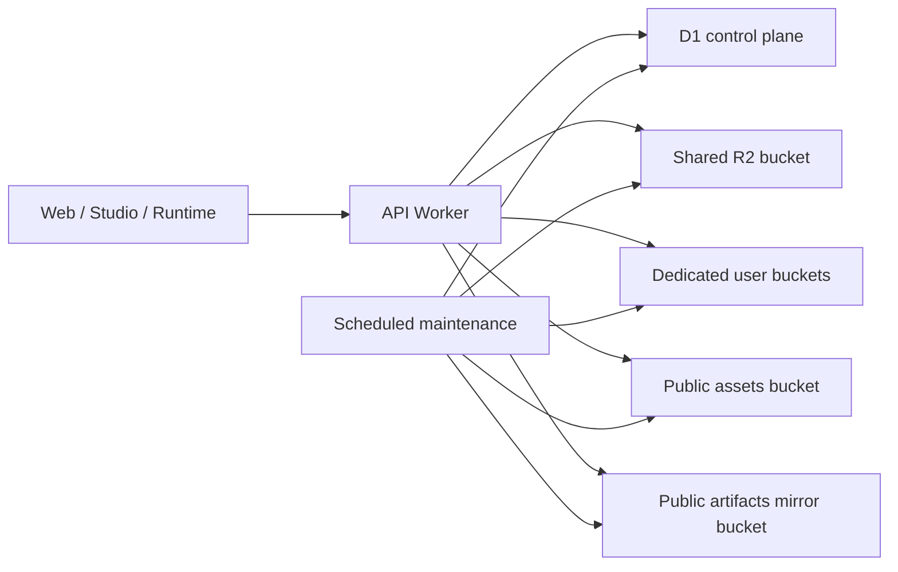

# Architecture

This document describes the public storage architecture used by Vibecodr as of 2026-03-21.

## Design Goals

- Separate byte storage from policy and accounting.
- Support free-tier shared storage and paid dedicated storage without forking the whole system.
- Make public delivery fast without broadening access to private bytes.
- Treat cleanup and reconciliation as part of the architecture, not janitorial work.
- Keep enough annotation to explain why the system looks this way.

## Control Plane vs Data Plane

The design is intentionally split:

- R2 stores object bytes.
- D1 stores ownership, visibility, quota categories, object lookup metadata, deduplication references, and mirror/maintenance state.
- Workers enforce the rules that decide which bucket to read from or write to, who can access an object, and how a response should be served.

## Main Components

### 1. `r2_objects` as the Storage Index

The central index tracks:

- `bucket_name`
- `r2_key`
- `object_id`
- `owner_id`
- `category`
- `size_bytes`
- `content_type`
- `visibility`
- optional hashed/encrypted share-token metadata

This table is used for:

- quota accounting,
- storage browser queries,
- lookup-by-object-id,
- lookup-by-share-token,
- visibility classification,
- cleanup and deletion,
- drift reconciliation.

This is the most important public takeaway from the design: R2 alone is not the storage system. R2 plus the control-plane index is the storage system.

### 2. Shared vs Dedicated Buckets

The write path resolves bucket choice from plan/entitlement state:

- free users write to a shared bucket,
- paid users can write to dedicated user buckets,
- read paths can fall back safely where compatibility requires it.

Why this exists:

- shared storage keeps free-tier operationally simple,
- dedicated buckets give paid storage stronger isolation and cleaner lifecycle control,
- the system still needs a common control-plane view across both.

### 3. Public Assets Are Not the Same as Public Artifacts

Vibecodr uses two different public-serving lanes:

- a public assets bucket for media such as avatars, thumbnails, and selected public user assets,
- a separate public artifact mirror bucket for published runtime bundles and manifest copies that are allowed to be edge-served directly.

That separation exists because a mixed public/private artifact lane was too broad. Public runtime delivery needed to be fast, but without turning the canonical artifact store into a bucket that felt public by default.

### 4. Blob Store for Deduplicated Capsule Files

Capsule file storage has a content-addressable blob-store path:

- `blobs` stores content-addressed object metadata,
- `capsule_blobs` maps capsule file paths to blob hashes.

The key design choice is that deduplicated blobs live in the shared bucket, even when a user is on a paid plan.

Why:

- cross-user deduplication only works cleanly if the shared blob lane is truly shared,
- a remix should not depend on the original uploader's private bucket continuing to exist,
- logical accounting can charge users for retained bytes without duplicating physical bytes.

This is one of the more interesting parts of the system and worth publishing.

### 5. Dependency Storage Uses the Same Pattern

Mirrored runtime dependencies use a similar model:

- `dependency_objects`
- `dependency_object_aliases`
- `artifact_dependency_refs`

The point is not only deduplication. It is also explicit logical ownership:

- one physical mirrored dependency object can exist once,
- many artifacts can reference it,
- each artifact can still be charged for logical retained bytes.

### 6. Public Artifact Mirror

When an artifact is publicly eligible, the system mirrors it into a dedicated public bucket.

Important details:

- mirror eligibility is gated by access policy,
- the bundle and manifest copy are written to the public mirror bucket,
- a mirror-complete sentinel is written last,
- revocation deletes mirrored keys and cache state.

This avoids the common trap where "public CDN delivery" quietly bypasses the real access policy.

## Key Prefixes

Representative keyspaces:

- `capsules/{capsuleId}/...`
- `drafts/{userId}/{draftId}/...`
- `avatars/{userId}/...`
- `thumbnails/{ownerOrPost}/...`
- `user-assets/{userId}/...`
- `artifacts/{artifactId}/...`
- `blobs/{sha256}/{uuid}`
- `deps/...`

These prefixes matter operationally because lifecycle jobs and browser queries reason about them explicitly.

## The Design History Matters

This architecture did not start here.

Some of the present shape is a direct response to earlier failures:

- Content-addressed capsule file keys were too broad and created collision/data-loss risk, so capsule storage and deduplication were separated.
- Public runtime delivery initially risked broadening access to canonical artifact storage, so the mirror bucket became its own lane.
- Storage accounting could not stay accurate if it was inferred from raw bucket contents, so D1 indexing became authoritative.
- Cleanup had to become explicit because background drift between D1 and R2 is unavoidable over time.

That history is one reason this repo exists. The goal is to show the design honestly, not to present it as a pristine greenfield system.
