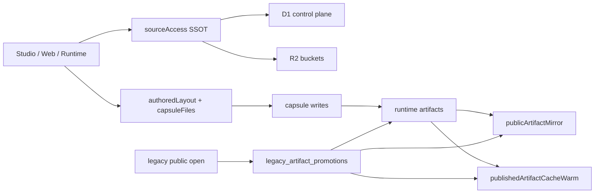

# Current Storage Contract

This page is the current entry point for the storage system after the 0A / 0A.2 work.

The older docs in this repo still matter, but they read best as background. If you want the present shape first, start here.

## What Changed

The live storage contract now has four owners that matter as much as the buckets themselves:

- `workers/api/src/ssot/sourceAccess.ts` owns read, list, entry, and snapshot shaping for viewer, studio, clone, export, compile, deploy, and operator intents.
- `workers/api/src/storage/capsuleFiles.ts` and `workers/api/src/domain/studio/authoredLayout.ts` own backend-authored path identity and the legacy-versus-standardized authored layout split.
- `workers/api/src/runtime/publicArtifactMirror.ts` and `workers/api/src/runtime/publishedArtifactCacheWarm.ts` own public runtime delivery, mirror readiness, and startup warming.
- `legacy_artifact_promotions` owns self-healing for old public launches that are cacheable but cannot be mirrored directly.

Buckets still store bytes, but they are no longer the whole answer.

## The Current Shape

## Read and List Access

`sourceAccess.ts` is the source owner for canonical snapshots.

It does a few things that the old storage-tour pages did not make explicit:

- it accepts an intent, not a guess;
- it shapes the visible file set differently for viewer, studio, clone, export, compile, deploy, and operator flows;
- it keeps the entry point, file bodies, and source metadata consistent for a given snapshot;
- it gives callers a stable source identity instead of making every caller rediscover the same path rules.

That means a Studio editor and a clone/export flow can look at the same capsule without pretending they need the same visibility surface.

## Authored Writes

The write side now has an explicit authored-path owner.

- `capsuleFiles.ts` canonicalizes authored paths and validates write intent.
- `authoredLayout.ts` decides whether a capsule is still in the legacy-preserve layout or has moved to standardized authored paths.
- `prepareAuthoredWriteBundle()` is the current gate for authored-write bundles and keeps the manifest entry aligned with the declared authored file set.

The important change is simple:

- the backend owns authored-path truth;
- the client can request a write, but it does not get to invent the canonical path model.

## Publish, Mirror, Warm

The publish path still writes runtime artifacts, but public delivery no longer treats the canonical artifact lane as directly public by default.

- `createRuntimeArtifactForCapsule()` builds the publishable artifact.
- `ensurePublicArtifactMirror()` first checks mirror configuration, then copies only mirrorable artifact-scoped objects into the public mirror bucket.
- The mirror flow re-checks public eligibility after it claims the D1 lease and again before it writes the sentinel manifest copy.
- If access flips private during the mirror window, the stale public copy is cleaned up instead of being left half-published.
- `warmPublishedArtifactStartupCachesNow()` primes the API and public lanes after publish or open.
- `isPublicArtifactMirrorReady()` can require the launch contract to be present when distinguishing old mirrored data from current mirrored data.

This keeps public edge delivery fast without turning the canonical artifact bucket into a public blob dump.

## Legacy Self-Heal

Some older public launches are still valid but not mirrorable.

Those are the ones handled by `legacy_artifact_promotions`:

- the request still serves the current artifact immediately;
- a background promotion is queued;
- the artifact is rebuilt from the canonical capsule bundle;
- live posts are switched through capsule lifecycle SSOT;
- the new runtime lane is warmed and mirrored;
- stale legacy mirror state is refreshed through the launch contract path when needed.

That is the current answer to "how do we get an old public launch off the Worker-only lane without breaking the open?"

## Tables Worth Knowing

The D1 side now makes the current shape visible through these tables:

- `capsules`
- `capsule_storage_modes`
- `capsule_authored_layout_modes`
- `r2_objects`
- `blobs`
- `capsule_blobs`
- `dependency_objects`
- `dependency_object_aliases`
- `artifact_dependency_refs`
- `public_artifact_mirror_leases`
- `legacy_artifact_promotions`

If a question is about the current storage contract, those tables are usually the shortest path to the answer.
