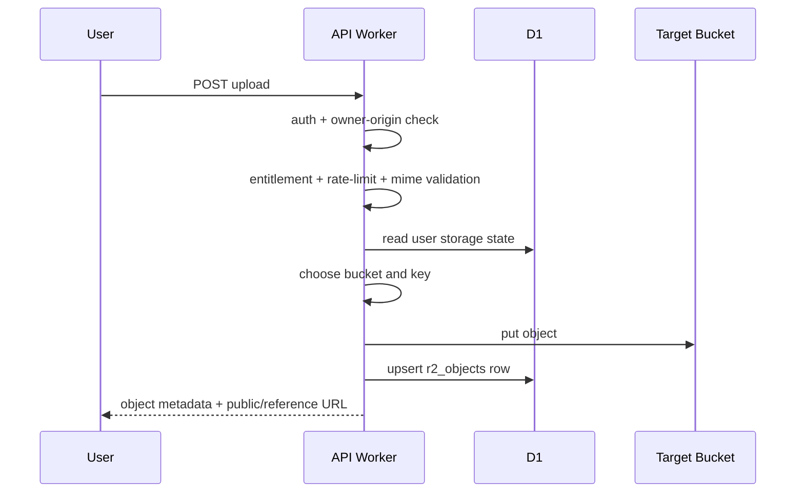
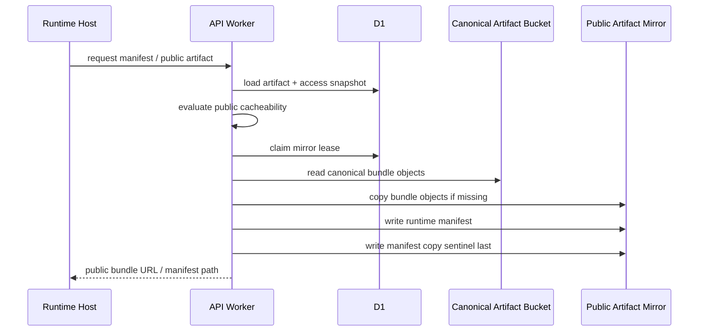

# Request Flows

This document shows the main storage flows at a system level.

## 1. User Asset Upload

Used for public CDN assets and private/reference assets in paid storage surfaces.

Pressure that shaped this flow:

- Uploads do not trust client-declared file type alone.
- Quota is checked before write, but accounting still depends on the D1 upsert succeeding.
- Public CDN delivery is opt-in by category/lane, not a property of "uploaded to R2".

## 2. Draft Compile / Publish

The compile/publish path writes runtime artifacts and then indexes them.

High-level flow:

1. Load owned capsule and manifest.
2. Resolve write bucket from plan.
3. Build runtime bundle and manifest.
4. Write runtime files to R2.
5. Upsert `r2_objects` for bundle and manifest keys.
6. Register dependency refs when dependency mirroring is involved.
7. Persist artifact metadata in D1.

Why it matters:

- the artifact write path is where logical storage accounting becomes durable,
- this is also where the public mirror lane can later be derived safely.

## 3. Public Artifact Mirror

Public runtime delivery is a mirror flow, not the canonical artifact store being treated as public.

Pressure that shaped this flow:

- public edge delivery was desired,
- but public eligibility still had to be revocable,
- and the canonical/private artifact lane could not quietly become public.

## 4. Private Download

Private reads remain Worker-mediated.

Flow:

1. Authenticate the request.
2. Apply owner-origin checks.
3. Resolve object metadata from D1 by object id, share token, or capsule file key.
4. Fetch the object from the resolved bucket.
5. Apply secure response headers, content type, CSP for scriptable types, and HTTP Range support.
6. Return the response from the Worker.

Why this flow exists:

- it keeps policy at the application layer,
- it avoids bearer-style presigned URL sprawl for private objects,
- it lets the platform control CSP, `nosniff`, and visibility semantics.

## 5. Capsule Blob Reads

Canonical capsule reads prefer blob-backed mappings:

1. Check `capsule_blobs` and `blobs`.
2. Resolve the underlying shared-bucket blob object.
3. Fallback to legacy-compatible capsule storage only when needed.

This compatibility layer exists because the system migrated toward blob-backed canonical storage rather than replacing every old capsule in one shot.

## 6. Cleanup And Reconciliation

There are two different maintenance ideas:

- lifecycle cleanup: delete or expire things according to category rules,
- reconciliation: compare D1 and R2 and repair drift.

Examples:

- retain drafts,
- remove orphaned avatars/covers/thumbnails,
- keep artifacts intentionally permanent unless policy says otherwise,
- detect "phantom" D1 rows that no longer have backing R2 objects,
- report "ghost" R2 objects that are not indexed.
